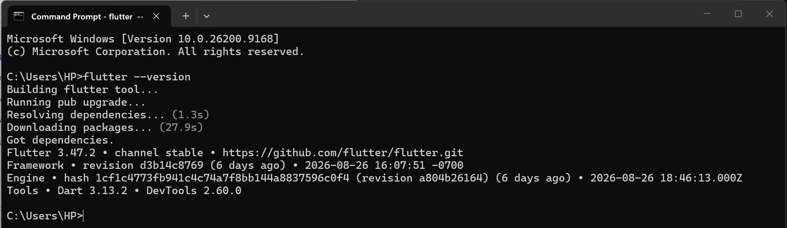
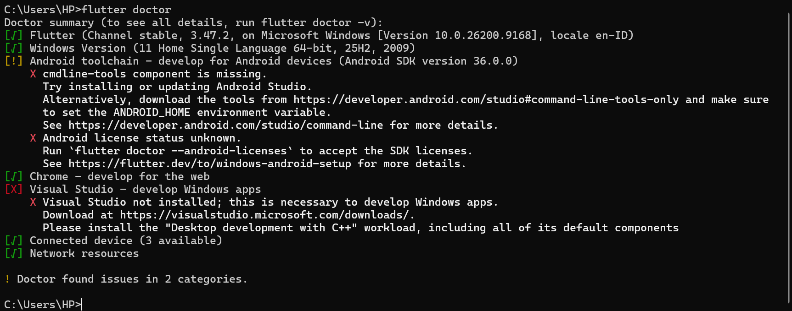
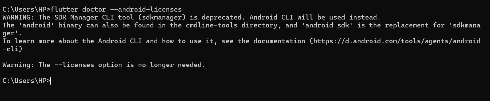
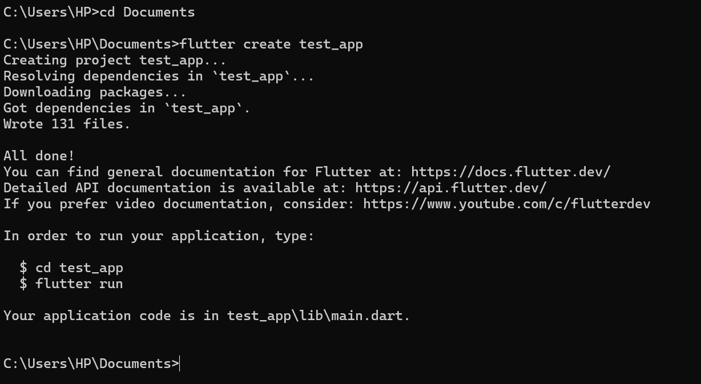
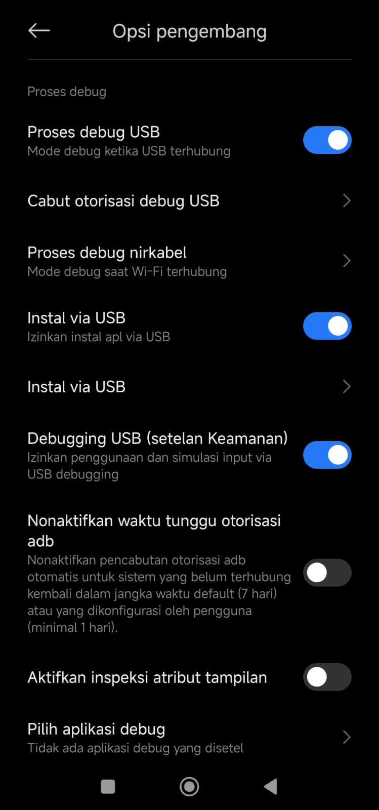
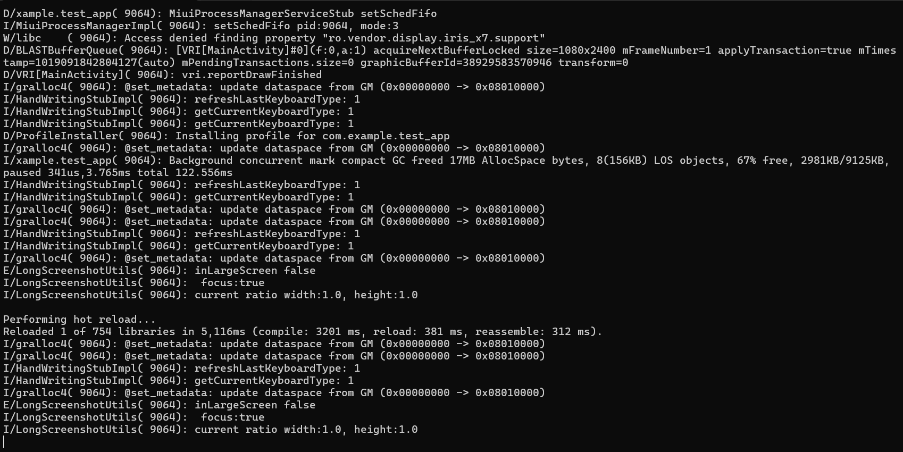
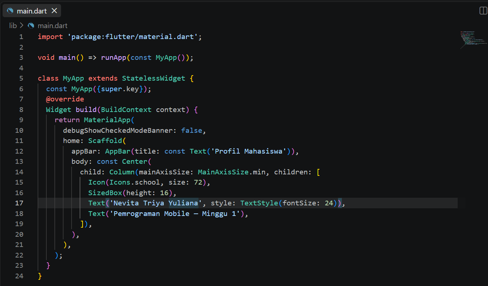
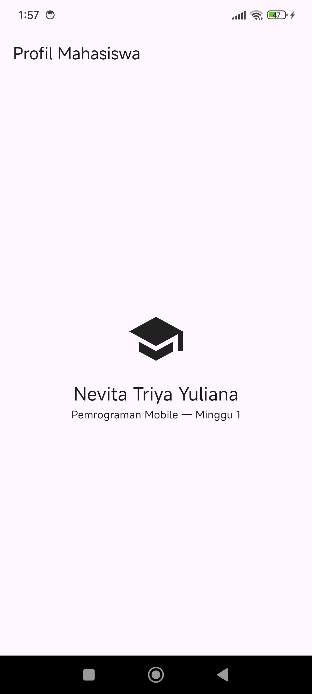
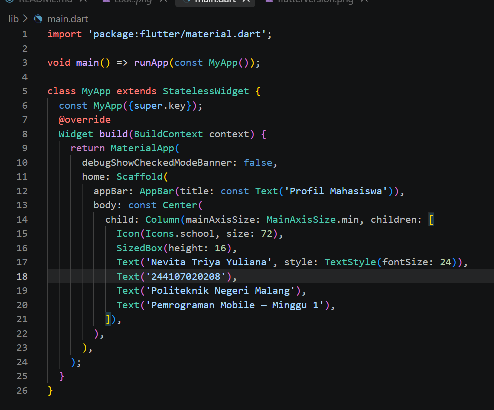
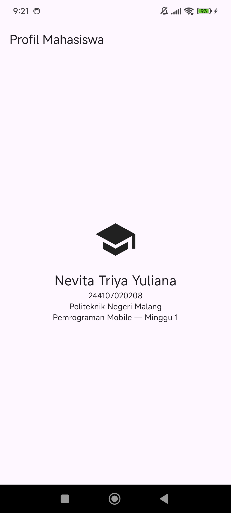

## NAMA  : NEVITA TRIYA YULIANA  
## KELAS : TI-3F  
## ABSEN : 20  

## Mobile Development Ecosystem & Flutter Refresh

<h3>4. Menyiapkan environment</h3>

 
<blockquote>

## flutter --version
  
## flutter doctor
  
## flutter doctor --android-licenses
Saya sempat dapat warning adi flutter doctor --android-licenses, sempat coba downgrade cmdline-tools, ternyata itu known bug, dan solusinya cukup lanjut flutter run karena license terhandle otomatis saat build  

</blockquote>

 

<h3>5. Praktikum: aplikasi Flutter pertama</h3>

 
<blockquote>

## Buat Project flutter

## Menggunakan USB

## fultter run

## Code

## Hasil run

</blockquote>

 

<h3>6. Tugas dan Refleksi</h3>

 
<blockquote>

## Penambahan NIM dan Asal Kampus

## Hasil run

## Refleksi
**Kapan native lebih tepat daripada cross-platform?**  
Native lebih unggul kalau butuh performa maksimal (game berat, editing video/audio real-time), akses API/hardware spesifik OS yang belum didukung baik oleh Flutter (misal fitur eksperimental terbaru dari Android/iOS), atau aplikasi yang harus sangat menyatu dengan look-and-feel platform tertentu.  
**Bagaimana perubahan state berhubungan dengan widget tree dan UI deklaratif?** 
Di Flutter, UI itu "fungsi dari state" tidak memanipulasi tampilan secara langsung (seperti setText() di native), tapi mendeskripsikan bagaimana UI seharusnya terlihat berdasarkan data saat ini. Saat state berubah (misal lewat setState()), Flutter membangun ulang (rebuild) widget tree yang terpengaruh, lalu membandingkan dengan tree sebelumnya (diffing), dan hanya me-render bagian yang benar-benar berubah.  
**Kenapa commit kecil dengan pesan jelas bermanfaat?** 
Memudahkan tracing kapan sebuah bug muncul (git bisect), memudahkan reviewer/rekan tim memahami perubahan tanpa harus baca ratusan baris sekaligus, dan riwayat commit yang rapi jadi bukti proses kerja yang bisa dinilai (bagus untuk portfolio karena menunjukkan cara berpikir, bukan cuma hasil akhir).

</blockquote>

 

