## NAMA  : NEVITA TRIYA YULIANA  
## KELAS : TI-3F  
## ABSEN : 20  

# Navigation & State Management

<h3>2. Konsep navigasi dan GoRouter</h3>

 
<blockquote>

## flutter pub add go_route
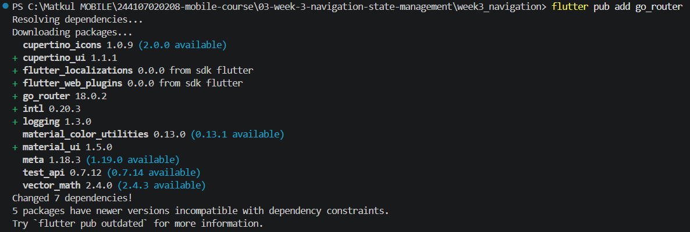 
## Susun struktur folder: 
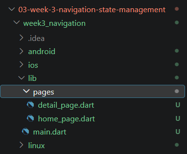 
## 1. Definisikan router di lib/main.dart: 
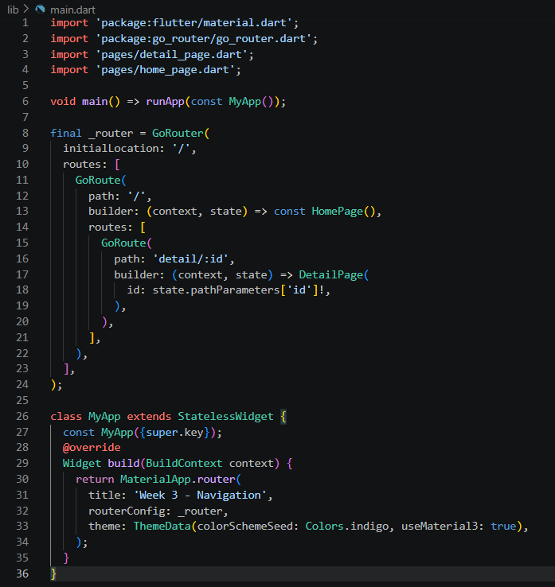 
## 2. Halaman Home (lib/pages/home_page.dart): 
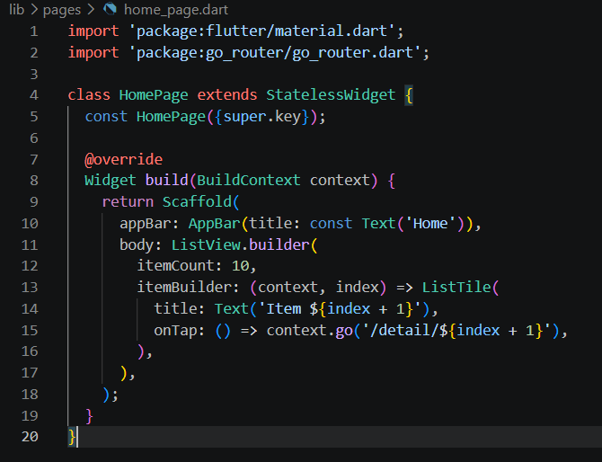 
## 3. Halaman Detail (lib/pages/detail_page.dart) 
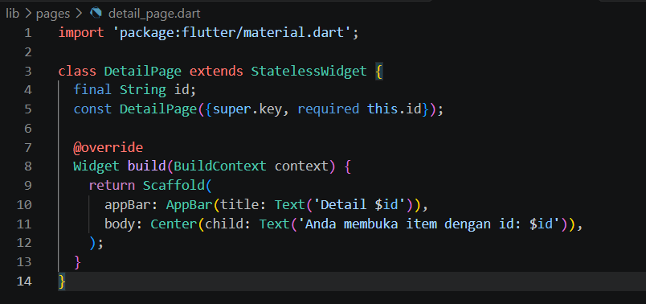 
## 4. Jalankan dan amati. Buka item, lalu tekan tombol back sistem. Perhatikan bahwa path berubah mengikuti layar aktif, path yang sama juga dapat diakses langsung tanpa melewati Home. Inilah keunggulan router deklaratif dibanding Navigator 1.0. 
| Tampilan hasil run | Tampilan Detail |
|---|---|
| 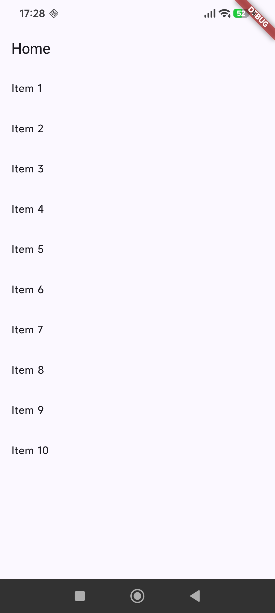 | 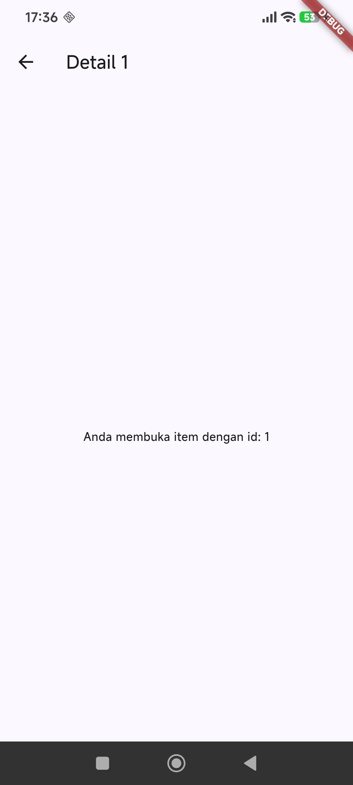 |
</blockquote>

 

<h3>3. State management dengan Riverpod</h3>

 
<blockquote>

## flutter pub add flutter_riverpod
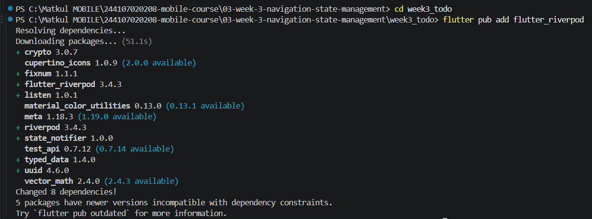 
## 1. Bungkus aplikasi dengan ProviderScope di lib/main.dart: 
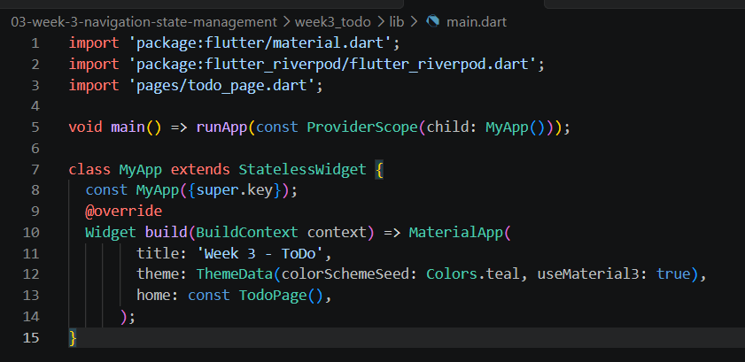 
## 2. Buat state dan provider (lib/providers/todo_provider.dart): 
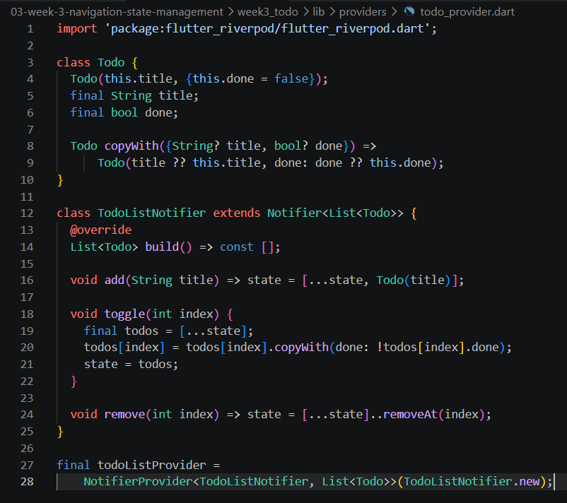 
## 3. Tampilkan dengan ConsumerWidget (lib/pages/todo_page.dart): 
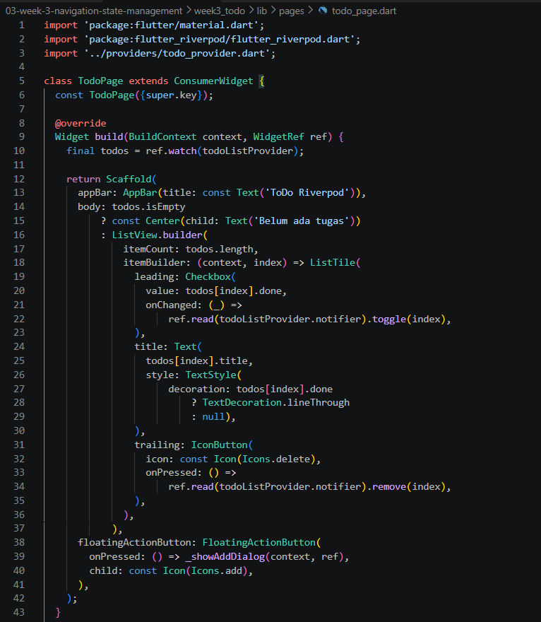 
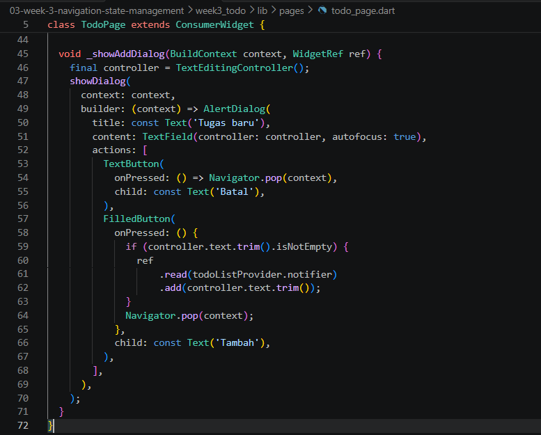 
## 4. Hasil Run 
| Tampilan hasil run | Tampilan Tambah |
|---|---|
| 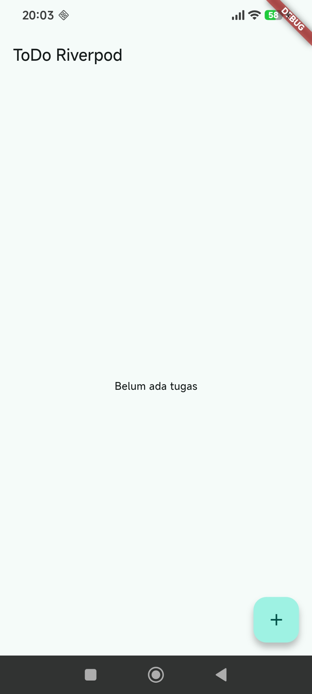 | 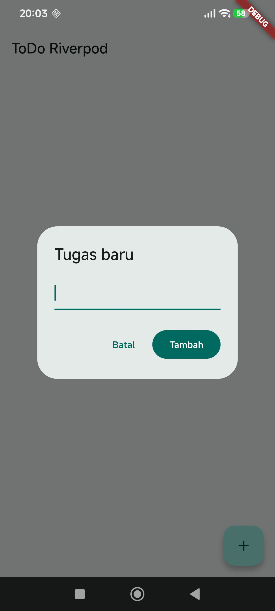 |

 

| Tampilan Sudah Selesai/Dicentang | Tampilan Hapus |
|---|---|
| 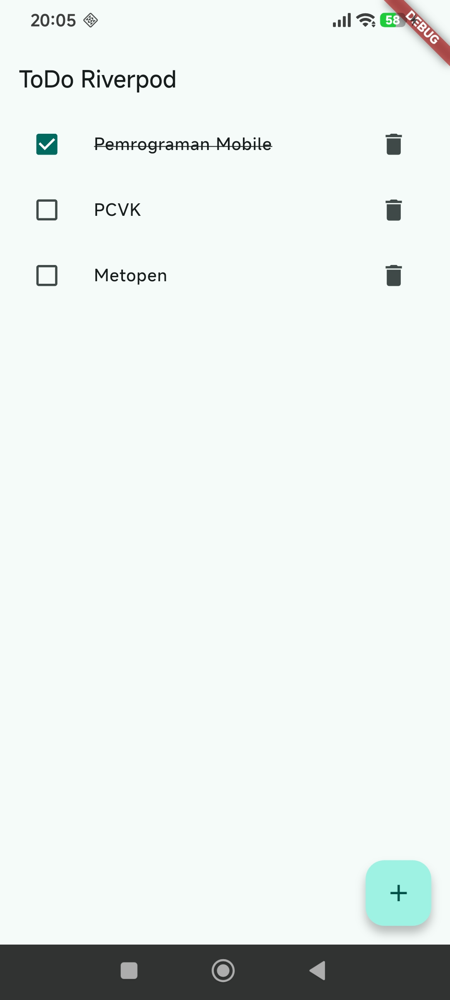 | 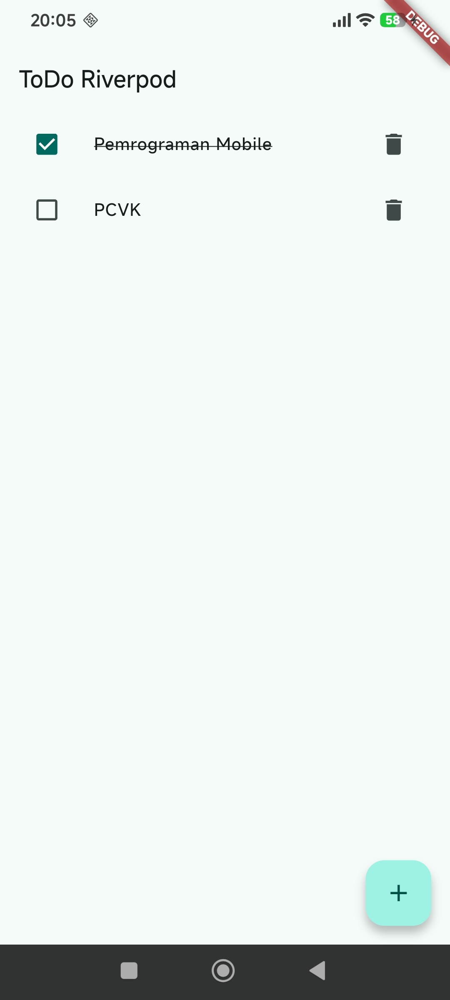 |
</blockquote>

 