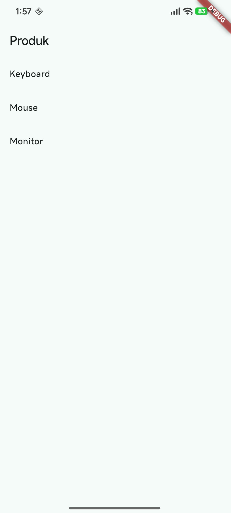
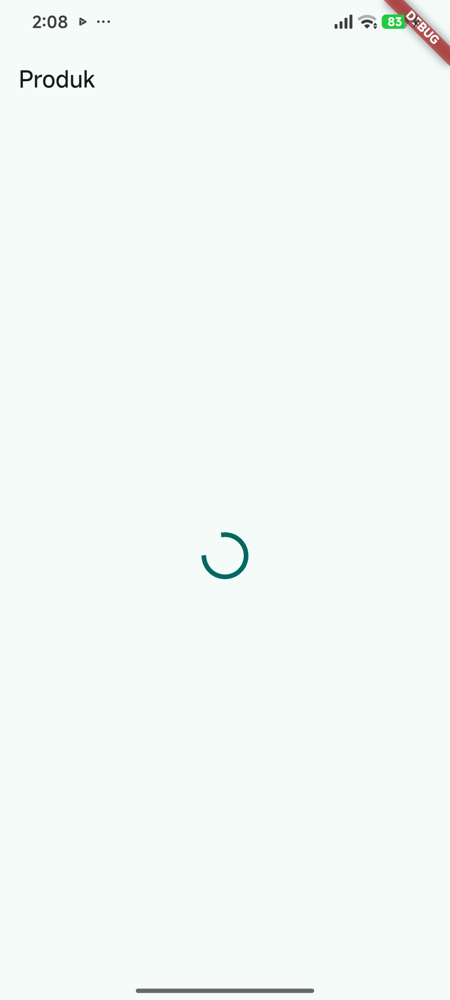
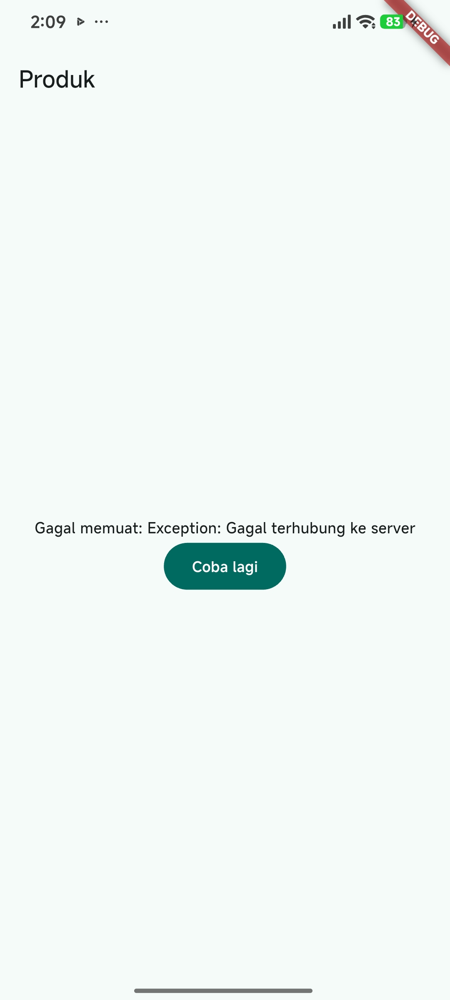

## NAMA  : NEVITA TRIYA YULIANA <br>
## KELAS : TI-3F <br>
## ABSEN : 20 <br>


# Navigation & State Management

<details>
<summary><h3>2. Konsep navigasi dan GoRouter</h3></summary>
<br>
<blockquote>

## flutter pub add go_route
<br>
## Susun struktur folder:<br>
<br>
## 1. Definisikan router di lib/main.dart:<br>
<br>
## 2. Halaman Home (lib/pages/home_page.dart):<br>
<br>
## 3. Halaman Detail (lib/pages/detail_page.dart)<br>
<br>
## 4. Jalankan dan amati. Buka item, lalu tekan tombol back sistem. Perhatikan bahwa path berubah mengikuti layar aktif, path yang sama juga dapat diakses langsung tanpa melewati Home. Inilah keunggulan router deklaratif dibanding Navigator 1.0.<br>
| Tampilan hasil run | Tampilan Detail |
|---|---|
|  |  |
</blockquote>
</details>

<br>

<details>
<summary><h3>3. State management dengan Riverpod</h3></summary>
<br>
<blockquote>

## flutter pub add flutter_riverpod
<br>
## 1. Bungkus aplikasi dengan ProviderScope di lib/main.dart:<br>
<br>
## 2. Buat state dan provider (lib/providers/todo_provider.dart):<br>
<br>
## 3. Tampilkan dengan ConsumerWidget (lib/pages/todo_page.dart):<br>
<br>
<br>
## 4. Hasil Run<br>
| Tampilan hasil run | Tampilan Tambah |
|---|---|
|  |  |

<br>

| Tampilan Sudah Selesai/Dicentang | Tampilan Hapus |
|---|---|
|  |  |
</blockquote>
</details>

<br>

<details>
<summary><h3>4. AsyncValue: loading, error, success</h3></summary>
<br>
<blockquote>

## main.dart (week3_todo)
```dart
import 'package:flutter/material.dart';
import 'package:flutter_riverpod/flutter_riverpod.dart';
import 'pages/product_page.dart';

void main() => runApp(const ProviderScope(child: MyApp()));

class MyApp extends StatelessWidget {
  const MyApp({super.key});
  @override
  Widget build(BuildContext context) => MaterialApp(
        title: 'Week 3 - Produk',
        theme: ThemeData(colorSchemeSeed: Colors.teal, useMaterial3: true),
        home: const ProductPage(),
      );
}
```
## product_page(week3_todo)
```dart
import 'package:flutter/material.dart';
import 'package:flutter_riverpod/flutter_riverpod.dart';
import '../providers/products_provider.dart';

class ProductPage extends ConsumerWidget {
  const ProductPage({super.key});

  @override
  Widget build(BuildContext context, WidgetRef ref) {
    final productsAsync = ref.watch(productsProvider);

    return Scaffold(
      appBar: AppBar(title: const Text('Produk')),
      body: productsAsync.when(
        loading: () => const Center(child: CircularProgressIndicator()),
        error: (err, stack) => Center(
          child: Column(
            mainAxisSize: MainAxisSize.min,
            children: [
              Text('Gagal memuat: $err'),
              FilledButton(
                onPressed: () => ref.invalidate(productsProvider),
                child: const Text('Coba lagi'),
              ),
            ],
          ),
        ),
        data: (products) => ListView.builder(
          itemCount: products.length,
          itemBuilder: (context, index) =>
              ListTile(title: Text(products[index])),
        ),
      ),
    );
  }
}
```
## products_provider(week3_todo)
```dart
import 'package:flutter_riverpod/flutter_riverpod.dart';

class ProductsNotifier extends AsyncNotifier<List<String>> {
  @override
  Future<List<String>> build() async {
    await Future.delayed(const Duration(seconds: 2)); // simulasi network
    return ['Keyboard', 'Mouse', 'Monitor'];
  }

  Future<void> refresh() async {
    state = const AsyncLoading();
    state = await AsyncValue.guard(() => _fetch());
  }

  Future<List<String>> _fetch() async {
    await Future.delayed(const Duration(seconds: 1));
    return ['Keyboard', 'Mouse', 'Monitor', 'Headset'];
  }
}

final productsProvider =
    AsyncNotifierProvider<ProductsNotifier, List<String>>(
        ProductsNotifier.new);
```

## Hasil Run nomor 1<br>
| Tampilan hasil run | 
|---|
| | 

## Uji state error pada nomor 2 modul
### products_provider
```dart
import 'package:flutter_riverpod/flutter_riverpod.dart';

class ProductsNotifier extends AsyncNotifier<List<String>> {
  @override
  Future<List<String>> build() async {
    await Future.delayed(const Duration(seconds: 2));
    throw Exception('Gagal terhubung ke server');
  }

  Future<void> refresh() async {
    state = const AsyncLoading();
    state = await AsyncValue.guard(() => _fetch());
  }

  Future<List<String>> _fetch() async {
    await Future.delayed(const Duration(seconds: 1));
    return ['Keyboard', 'Mouse', 'Monitor', 'Headset'];
  }
}

final productsProvider =
    AsyncNotifierProvider<ProductsNotifier, List<String>>(
        ProductsNotifier.new);
```
### hasil run nomor 2
| Tampilan Loading | Tampilan Gagal |
|---|---|
|  |  |

## Tombol Coba lagi dan pemulihan pada nomor 3
### products.provider
```dart
import 'package:flutter_riverpod/flutter_riverpod.dart';

class ProductsNotifier extends AsyncNotifier<List<String>> {
  @override
    Future<List<String>> build() async {
    await Future.delayed(const Duration(seconds: 2));
    return ['Keyboard', 'Mouse', 'Monitor'];
}

  Future<void> refresh() async {
    state = const AsyncLoading();
    state = await AsyncValue.guard(() => _fetch());
  }

  Future<List<String>> _fetch() async {
    await Future.delayed(const Duration(seconds: 1));
    return ['Keyboard', 'Mouse', 'Monitor', 'Headset'];
  }
}

final productsProvider =
    AsyncNotifierProvider<ProductsNotifier, List<String>>(
        ProductsNotifier.new);
```
### hasil run nomor 3
| Tampilan setelah klik coba lagi| 
|---|
| | 

## refleksi pada poin nomor 4 
**Mengapa menampilkan data lama dengan indikator refresh kadang lebih baik daripada mengosongkan layar?** <br>
- Pengguna tidak kehilangan konteks: daftar yang sedang dibaca tidak tiba-tiba hilang.<br>
- Data lama biasanya masih berguna selagi data baru dimuat.<br>
- Aplikasi terasa lebih cepat dan tidak berkedip. <br>
- Jika refresh gagal, data lama masih bisa ditampilkan dengan pesan error kecil, bukan layar kosong. <br>

</blockquote>
</details>

<br>