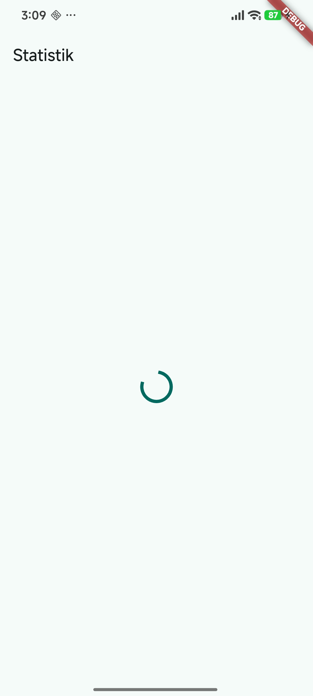
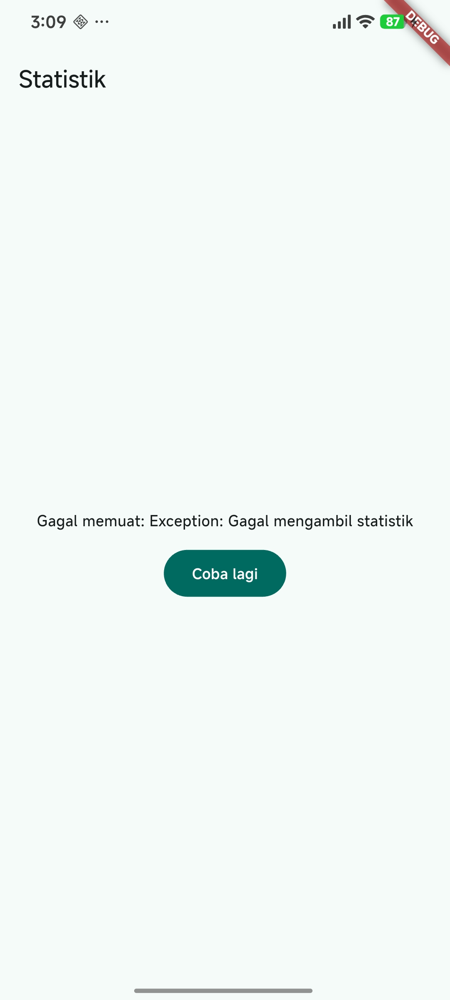
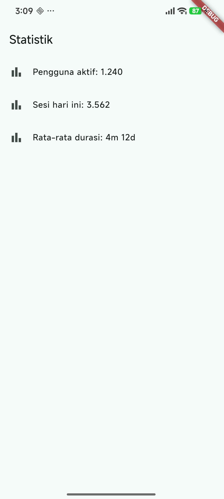
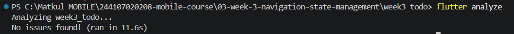
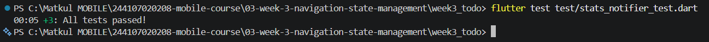

## 1. Prompt yang Digunakan

```
Buatkan halaman Flutter bernama StatsPage menggunakan flutter_riverpod.
Requirements:
- ConsumerWidget dengan satu AsyncNotifierProvider yang mensimulasikan
  pengambilan data statistik (delay 2 detik, kadang gagal 30%).
- UI harus menangani loading (spinner), error (pesan + tombol retry),
  dan success (ListView 3 item).
- Berikan unit test untuk notifier-nya.
Jelaskan setiap bagian kode dalam komentar.
```

## 2. Output Awal AI (belum diperbaiki)

File yang dihasilkan AI:

| File | Fungsi |
|---|---|
| `lib/providers/stats_provider.dart` | `StatsNotifier` (AsyncNotifier), delay 2 detik, gagal 30% |
| `lib/pages/stats_page.dart` | `StatsPage` (ConsumerWidget) dengan `.when` loading/error/data |
| `test/stats_notifier_test.dart` | Unit test: sukses, gagal, retry |

### stats_provider.dart
```dart
import 'dart:math';
import 'package:flutter_riverpod/flutter_riverpod.dart';

/// Provider untuk sumber angka acak.
/// Dipisah agar pada unit test bisa diganti (override) dengan nilai tetap,
/// sehingga hasil "gagal 30%" bisa diuji secara deterministik.
final statsRandomProvider = Provider<Random>((ref) => Random());

/// Provider untuk lama delay simulasi jaringan.
/// Di aplikasi 2 detik, di test dibuat nol agar test cepat.
final statsDelayProvider =
    Provider<Duration>((ref) => const Duration(seconds: 2));

/// Notifier asinkron. Tipe state: AsyncValue<List<String>>
/// (loading / error / data otomatis dikelola Riverpod).
class StatsNotifier extends AsyncNotifier<List<String>> {
  /// build() dijalankan saat provider pertama kali dibaca.
  /// Selama Future belum selesai, state = AsyncLoading.
  @override
  Future<List<String>> build() => _fetch();

  /// Dipanggil tombol "Coba lagi".
  /// state diganti dengan objek baru (AsyncLoading, lalu hasil guard),
  /// tidak pernah dimutasi langsung.
  Future<void> retry() async {
    state = const AsyncLoading();
    state = await AsyncValue.guard(_fetch);
  }

  /// Simulasi pengambilan data: tunggu, lalu gagal dengan peluang 30%.
  Future<List<String>> _fetch() async {
    // ref dibaca SEBELUM await agar tidak dipakai setelah provider mungkin dibuang.
    final delay = ref.read(statsDelayProvider);
    final random = ref.read(statsRandomProvider);

    await Future.delayed(delay);

    if (random.nextDouble() < 0.3) {
      throw Exception('Gagal mengambil statistik');
    }
    return ['Pengguna aktif: 1.240', 'Sesi hari ini: 3.562', 'Rata-rata durasi: 4m 12d'];
  }
}

/// Provider dengan tipe eksplisit <StatsNotifier, List<String>>.
/// retry: (_, __) => null mematikan auto-retry bawaan Riverpod 3.x,
/// supaya error langsung tampil dan tombol "Coba lagi" bermakna.
final statsProvider =
    AsyncNotifierProvider<StatsNotifier, List<String>>(
  StatsNotifier.new,
  retry: (retryCount, error) => null,
);
```

### stats_page.dart
```dart
import 'package:flutter/material.dart';
import 'package:flutter_riverpod/flutter_riverpod.dart';
import '../providers/stats_provider.dart';

/// ConsumerWidget: seperti StatelessWidget, tetapi build() menerima `ref`.
class StatsPage extends ConsumerWidget {
  const StatsPage({super.key});

  @override
  Widget build(BuildContext context, WidgetRef ref) {
    // watch hanya di build: UI otomatis dibangun ulang saat state berubah.
    final statsAsync = ref.watch(statsProvider);

    return Scaffold(
      appBar: AppBar(title: const Text('Statistik')),
      // when() memaksa ketiga kondisi ditangani.
      body: statsAsync.when(
        // 1) Loading: spinner.
        loading: () => const Center(child: CircularProgressIndicator()),

        // 2) Error: pesan dan tombol retry.
        error: (err, stack) => Center(
          child: Column(
            mainAxisSize: MainAxisSize.min,
            children: [
              Text('Gagal memuat: $err'),
              const SizedBox(height: 12),
              FilledButton(
                // read di callback: hanya memanggil method, tanpa berlangganan.
                onPressed: () => ref.read(statsProvider.notifier).retry(),
                child: const Text('Coba lagi'),
              ),
            ],
          ),
        ),

        // 3) Success: ListView 3 item.
        data: (stats) => ListView.builder(
          itemCount: stats.length,
          itemBuilder: (context, index) => ListTile(
            leading: const Icon(Icons.bar_chart),
            title: Text(stats[index]),
          ),
        ),
      ),
    );
  }
}
```

### stats_notifier_test.dart
```dart
import 'dart:math';
import 'package:flutter_riverpod/flutter_riverpod.dart';
import 'package:flutter_test/flutter_test.dart';
import 'package:week3_todo/providers/stats_provider.dart';

/// Random palsu: mengembalikan nilai berurutan dari daftar.
/// Nilai < 0.3 berarti "gagal", nilai >= 0.3 berarti "sukses".
class FakeRandom implements Random {
  FakeRandom(this.values);
  final List<double> values;
  int _i = 0;

  @override
  double nextDouble() => values[_i++ % values.length];
  @override
  int nextInt(int max) => 0;
  @override
  bool nextBool() => false;
}

ProviderContainer makeContainer(List<double> randomValues) {
  final container = ProviderContainer(overrides: [
    statsRandomProvider.overrideWithValue(FakeRandom(randomValues)),
    statsDelayProvider.overrideWithValue(Duration.zero),
  ]);
  addTearDown(container.dispose);
  return container;
}

void main() {
  test('sukses: mengembalikan 3 item statistik', () async {
    final container = makeContainer([0.9]);

    final data = await container.read(statsProvider.future);

    expect(data.length, 3);
  });

  test('gagal: state menjadi error saat random < 0.3', () async {
    final container = makeContainer([0.1]);

    await expectLater(
      container.read(statsProvider.future),
      throwsException,
    );
    expect(container.read(statsProvider).hasError, isTrue);
  });

  test('retry: error pertama, lalu pulih menjadi data', () async {
    // Panggilan pertama gagal (0.1), panggilan kedua sukses (0.9).
    final container = makeContainer([0.1, 0.9]);

    await expectLater(
      container.read(statsProvider.future),
      throwsException,
    );

    await container.read(statsProvider.notifier).retry();

    final state = container.read(statsProvider);
    expect(state.hasValue, isTrue);
    expect(state.value!.length, 3);
  });
}
```

## 3. Hasil Run

| Loading | Error | Success | 
|---|---|---|
|  |  |  |

Penjelasan:

- **Loading:** spinner tampil di tengah layar selama 2 detik pertama (simulasi pengambilan data).
- **Error:** muncul pesan `Gagal memuat: Exception: Gagal mengambil statistik` dan tombol **Coba lagi**. Tombol memanggil `retry()` sehingga data diambil ulang.
- **Success:** `ListView` menampilkan 3 item statistik (Pengguna aktif, Sesi hari ini, Rata-rata durasi) dengan ikon bar chart.


## 5. Hasil Testing

### flutter analyze


### flutter test test/stats_notifier_test.dart
